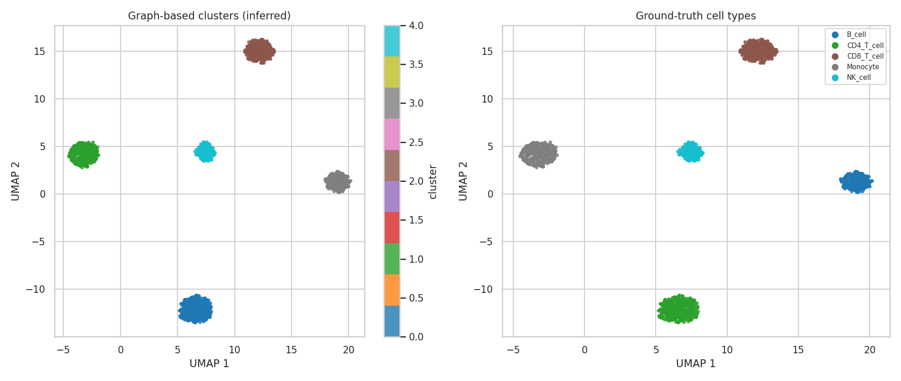

# scRNA-seq Clustering Pipeline

A single-cell RNA-seq analysis pipeline built from first principles in Python —
covering the same stages as a standard Scanpy/Seurat workflow, implemented
directly with NumPy/pandas/scikit-learn/NetworkX so every step is transparent
and inspectable rather than hidden behind a single library call.

## Pipeline stages

1. **Quality control** — filter low-quality cells and rarely-detected genes
2. **Normalization** — library-size (CPM) scaling + log1p transform
3. **Highly variable gene (HVG) selection** — dispersion-based, Seurat-style, binned by mean expression
4. **Dimensionality reduction** — PCA on scaled HVG expression
5. **Graph-based clustering** — k-nearest-neighbour graph + greedy modularity community detection (Louvain-style)
6. **2D embedding** — UMAP for visualization
7. **Marker gene detection** — per-cluster Welch's t-test with Benjamini-Hochberg FDR correction
8. **Evaluation** — Adjusted Rand Index (ARI) and Normalized Mutual Information (NMI) against ground truth

## Why simulated data?

`src/simulate_data.py` generates a synthetic droplet-based (10x-style) count
matrix with negative-binomial overdispersion, dropout, and five ground-truth
immune cell populations (CD4 T, CD8 T, B, Monocyte, NK), each defined by a
disjoint block of marker genes. This keeps the repository fully offline and
reproducible while exercising every real analysis step. **The pipeline itself
is data-agnostic** — point `load_data()` at any real count matrix (e.g. from
`scanpy.read_10x_mtx()` or a public GEO dataset) to run the same analysis on
real data.

## Results

On the simulated dataset (1300 cells x 2000 genes), the pipeline recovers all
5 cell populations with **ARI = 1.00, NMI = 1.00** against ground truth:



## Usage

```bash
pip install -r requirements.txt
python src/simulate_data.py   # generates data/
python src/pipeline.py        # runs the full analysis, writes results/
```

## Repository structure

```
├── src/
│   ├── simulate_data.py   # synthetic scRNA-seq data generator
│   └── pipeline.py        # QC -> normalization -> HVG -> PCA -> clustering -> markers
├── data/                  # generated count matrix + metadata (git-ignored, regenerate via script)
├── results/                # figures, marker tables, cluster assignments
└── requirements.txt
```

## Author

Amirhossein Soltani — Bioinformatician / Computational Biologist.
MSc Bioinformatics, University of Leicester. Background in RNA-seq/scRNA-seq
analysis (Seurat, Scanpy, DESeq2, edgeR, GATK) and structural bioinformatics
(AlphaFold3, PyMOL).
